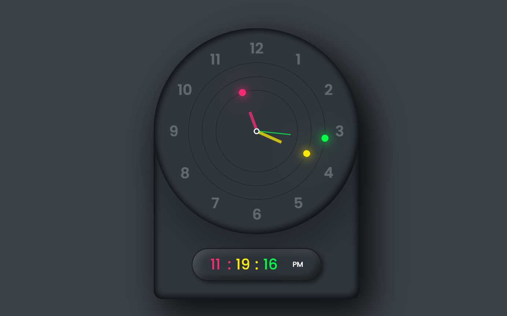

# 🕒 NeoClock

A stylish analog + digital clock made with **HTML, CSS, and JavaScript**.  
This project displays both analog hands and digital time, including **AM/PM format** and real-time updates.

---

## 📷 
 

---
## 🔗 Live Demo

👉 https://neo-clock-suman-rauls-projects.vercel.app/

---

## 🛠 Tech Stack

- HTML
- CSS
- JavaScript

---

## ✨ Features

- Smooth analog clock hands
- Digital time with AM/PM
- Responsive design
- Clean UI

---

## 🚀 Author

Made with ❤️ by [SUMAN RAUL](https://github.com/Suman-20)
